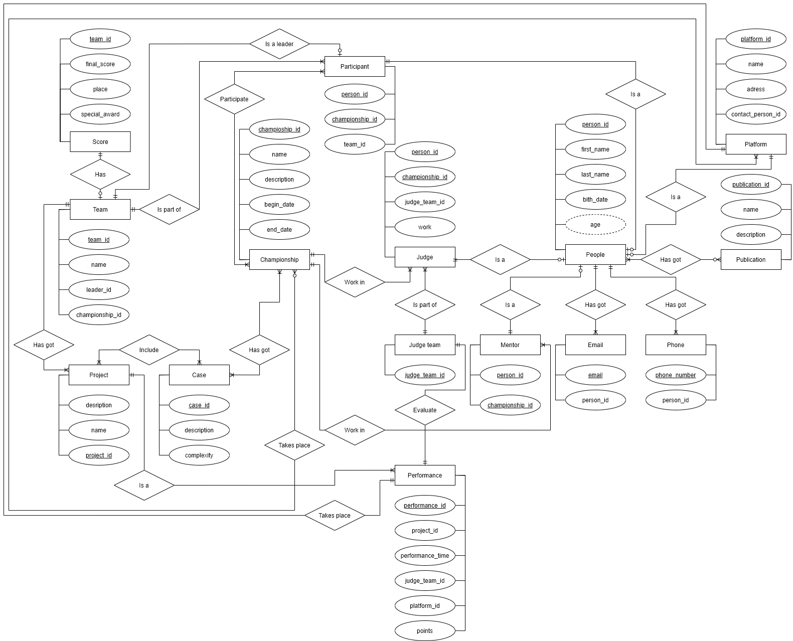

# Курсовой проект по дисциплине "Информационные системы и базы данных"

### Предметная область

Кейс Чемпионат

### Описание

**Кейс-чемпионат** – это соревнование, во время которого участники, студенты и выпускники вузов, в командах решают бизнес-задачи. Эти задачи составляют партнеры чемпионата – крупные компании. Участникам разрешено обращаться за помощью к экспертам и тренерам. Представители компаний (члены жюри) оценивают результаты решения кейсов.

Традиционно кейс чемпионаты подразумевают поэтапную проработку командой отдельных частей одного проекта. Создаваемая база данных направлена на хранение промежуточных и итоговых данных “турнирной таблицы”, а также информации о судейской коллегии и наставниках команд.

Чемпионат проводиться только если набралась хотя бы одна судейская бригада, зарегистрировалась хотя бы одна команда, а также были найдены помещения для проведения данного чемпионата. 

Чтобы участник мог принять участие в чемпионате, то ему необходимо зарегистрироваться, указав информацию о себе (имя, фамилию, дату рождения и хотя бы один действующий e-mail адрес).

Участником может стать любой человек не достигший 27 лет. Он не может быть при этом судьёй или тренером.

Тренером может стать любой человек достигший возраста 21 год. Также в его портфолио должна быть хотя бы одна научная публикация.

Команды участников состоят из 2-5 участников, среди которых один капитан команды. Также у команды могут быть тренера (не больше 2).

Проект состоит из кейсов (не меньше одного), каждый кейс оценивается отдельно и имеет свою сложность, что влияет на итоговый результат. Максимальная оценка за один Кейс не превосходит 10 баллов. 

Выигрывает команда, набравшая максимальную сумму баллов за все свои Кейсы. 

Оценивание проектов происходит судейскими бригадами, состоящим из 3 судьей. Менторы не могут являться судьями.

Всё происходит на разных площадках в соответствии с расписанием. 

Таким образом совокупность всех таблиц направлена на помощь в выявлении победителей и призеров.

### ER-модель

### Даталогическая модель

### Текстовое описание сущностей

**Case**:
* `case_id` (id кейса);
* `description` (описание задания кейса);
* `complexity` (сложность кейса).

**Championship**:
* `championship_id` (id чемпионата);
* `name` (название чемпионата);
* `description` (описание чемпионата);
* `begin_date` (дата начала чемпионата);
* `end_date` (дата конца чемпионата).

**Email**:
* `email` (почтовый адрес);
* `person_id` (id человека из таблицы person, которому принадлежит данный почтовый адрес).

**Judge**:
* `person_id` (id человека из таблицы person, который является судьей);
* `championship_id` (id чемпионата из таблицы championship, судьей которого является данный человек);
* `work` (название компании в которой работает судья);
* `judge_team_id` (id судейской бригады из таблицы Judge_Team, частью которой является судья).

**Judge_Team**:
* `judge_team_id` (id судейской бригады);

**Mentor**:
* `person_id` (id человека из таблицы person, который является ментором);
* `championship_id` (id чемпионата из таблицы championship, ментором которого является данный человек).

**Participant**:
* `person_id` (id человека из таблицы person, который является участником);
* `championship_id` (id чемпионата из таблицы championship, участником которого является данный человек);
* `team_id` (id команды из таблицы team, участником которой является данный человек).

**People**:
* `person_id` (id человека);
* `first_name` (имя человека);
* `last_name` (фамилия человека);
* `birth_date` (дата рождения);
* `age` (возраст участника (вычисляется)).

**Performance**:
* `performance_id` (id выступления);
* `project_id` (id проекта из таблицы project);
* `performance_time` (время, затраченное командой на решение кейса);
* `judge_team_id` (id судейской бригады из таблицы judge_team, которая судит данный проект);
* `platform_id` (id места проведения из таблицы platform);
* `points` (очки, заработанные командой).

**Phone**:
* `phone_number` (номер телефона);
* `person_id` (id человека из таблицы person, которому принадлежит данный номер телефона).

**Platform**:
* `platform_id` (id места проведения);
* `name` (название площадки);
* `address` (адрес площадки);
* `contact_person_id` (id человека из таблицы person, который является контактным лицом на площадке).

**Project**:
* `project_id` (id проекта);
* `name` (название проекта);
* `team_id` (id команды из таблицы team, которая делает данный проект);
* `description` (краткое описание проекта).

**Publication**:
* `publication_id` (id публикации);
* `name` (название публикации);
* `description` (аннотация статьи, её краткое содержание).

**Score**:
* `team_id` (id команды из таблицы team, баллы которой храним);
* `final_score` (финальные баллы команды);
* `place` (место в турнирной таблице);
* `special_award` (специальный приз).

**Team**:
* `team_id` (id команды);
* `name` (название команды);
* `leader_id` (id человека из таблицы participant, который является капитаном данной команды).

### Сценарии использования базы данных:

Из предназначения базы данных следуют основные пути её использования:
* Регистрация: 
    * участника;
    * судьи;
    * ментора;
* Создание команды.
* Оценка выступления команды; 
* Открытие чемпионата;
* Закрытие чемпионата.

Прецеденты использования базы данных:

| Имя прецедента | Добавление человека|
| :-----: | :- |
| ID | 1 |
| Предусловия | О человеке должна быть обязательно заполнена следующая информация: Имя, Фамилия, Дата рождения, Адрес электронной почты и телефон.|
| Основной поток | <ol> <li>Создаётся человек с `first_name`, `last_name`, `birth_date` равными переданным в функцию значениям. </li> <li>В таблицу `email` заносится, переданное функции значение `email`.</li> <li>В таблицу `phone` заносится, переданное функции значение `phone_number`.</li> </ol>|

| Имя прецедента | Добавление участника|
| :-----: | :- |
| ID | 2 |
| Предусловия | Об участнике чемпионата должна быть обязательно заполнена следующая информация: Имя, Фамилия, Дата рождения, Адрес электронной почты и телефон и указан id чемпионата в котором он участвует. Также участник должен быть моложе 27 лет и не являться ментором или судьёй в рамках одного чемпионата. |
| Основной поток | <ol> <li> Вызывается прецедент "Добавление человека". </li> <li> Создаётся участник с `team_id`, `champinship_id` равными переданным в функцию значениям и `person_id` равным id только что созданного человека.</li> </ol>| 

| Имя прецедента | Добавление судьи|
| :-----: | :- |
| ID | 3 |
| Предусловия | О судье чемпионата должна быть обязательно заполнена следующая информация: Имя, Фамилия, Дата рождения, Адрес электронной почты и телефон и указан id чемпионата в котором он участвует. Также судья должен иметь не менее одной публикации, быть старше 21 года и не являться ментором или участником в рамках одного чемпионата.|
| Основной поток | <ol> <li> Вызывается прецедент "Добавление человека". </li> <li> Создаётся судья с `judge_team_id`, `champinship_id`, `work` равными переданным в функцию значениям и `person_id` равным id только что созданного человека.</li> </ol>|

| Имя прецедента | Добавление судейской бригады|
| :-----: | :- |
| ID | 4 |
| Предусловия | Судейская бригада должна состоять ровно из 3 судей, принадлежащих одному чемпионату.|
| Основной поток | <ol> <li> Обновление таблицы judge, установление `judge_team_id` равного значению переданному в функцию.</ol> </li>

| Имя прецедента | Добавление ментора|
| :-----: | :- |
| ID | 5 |
| Предусловия | О менторе чемпионата должна быть обязательно заполнена следующая информация: Имя, Фамилия, Дата рождения, Адрес электронной почты и телефон и указан id чемпионата в котором он участвует. Также судья должен иметь не менее одной публикации, быть старше 21 года и не являться ментором или участником в рамках одного чемпионата.|
| Основной поток | <ol> <li> Вызывается прецедент "Добавление человека". </li> <li> Создаётся судья с `champinship_id` равным переданному в функцию значению и `person_id` равным id только что созданного человека.</ol> </li>

| Имя прецедента | Добавление публикации|
| :-----: | :- |
| ID | 6 |
| Предусловия | У публикации должно быть название и краткое описание. |
| Основной поток | <ol> <li> Создается публикация с `name` и `description` равными переданным в функцию значениям.</ol> </li>

| Имя прецедента | Добавление публикации с данными об авторах|
| :-----: | :- |
| ID | 7 |
| Предусловия | У публикации должно быть название и краткое описание. Авторы публикации есть в таблице `people`.|
| Основной поток | <ol> <li> Выполняется прецедент "Добавление публикации". </li> <li> Создается запись в таблице `people_publication` с `person_id` равным переданному в функцию значению и `publication_id` равным id только что созданной публикации.</ol> </li>

| Имя прецедента | Добавление сведений об авторстве в публикацию|
| :-----: | :- |
| ID | 8 |
| Предусловия | Существуют данные о публикации в таблице `publication` и о человеке в таблице `people`. |
| Основной поток | <ol> <li> Создается запись в таблице `people_publication` с `person_id` и `publication_id` равными переданным в функцию значениям.</ol> </li>

| Имя прецедента | Добавление команды без ментора в чемпионат|
| :-----: | :- |
| ID | 9 |
| Предусловия | В команде должно быть от 2 до 5 человек (являются участниками одного чемпионата) среди которых должен быть капитан.|
| Основной поток | <ol> <li> Создается команда с `name`, `leader_id`, `championship_id` равными переданным в функцию значениям.</ol> </li>

| Имя прецедента | Добавление ментора к команде|
| :-----: | :- |
| ID | 10 |
| Предусловия | Сведенья о команде и менторе должны существовать.|
| Основной поток | <ol> <li> Создается запись в таблице `mentor_team` с `team_id`, `mentor_id` и `championship_id` равными переданным в функцию значениям.</ol> </li>

| Имя прецедента | Добавление команды с ментором в чемпионат|
| :-----: | :- |
| ID | 11 |
| Предусловия | В команде должно быть от 2 до 5 человек (являются участниками одного чемпионата), среди которых должен быть капитан. У команды не должно быть более 2 менторов в рамках чемпионата. Сведенья о менторах должны существовать.|
| Основной поток | <ol> <li> Выполняется прецедент "Добавление команды без ментора в чемпионат" </li> <li> Выполняется прецедент "Добавление ментора к команде".</ol> </li>|

| Имя прецедента | Добавление платформ чемпионата|
| :-----: | :- |
| ID | 12 |
| Предусловия | Платформа должна иметь название, адрес и id человека, являющегося контактным лицом чемпионата. |
| Основной поток | <ol> <li> Создается платформа с `name`, `address` и `contact_person_id` равными переданным в функцию значениям.</ol> </li>

| Имя прецедента | Добавление чемпионата|
| :-----: | :- |
| ID | 13 |
| Предусловия | У чемпионата должны быть название, описание, хотя бы одна платформа проведения, хотя бы одна судейская бригада, хотя бы команда участников имеющая проект и хотя бы один кейс. |
| Основной поток | <ol> <li> Создается чемпионат с `name`, `description`, `cases` и `platforms` равными переданным в функцию значениям. |

| Имя прецедента | Добавление проекта|
| :-----: | :- |
| ID | 14 |
| Предусловия |проекта должно быть название, описание, id команды, которая его делает, хотя бы один кейс решаемый в данном чемпионате.|
| Основной поток | <ol> <li> Создается проект с `name`, `description`, `cases` и `team_id` равными переданным в функцию значениям.</ol> </li>

| Имя прецедента | Добавление кейса|
| :-----: | :- |
| ID | 15 |
| Предусловия | У кейса должно быть название, описание и сложность.|
| Основной поток |<ol> <li> Создается кейс с `name`, `description` и `complexity` равными переданным в функцию значениям.</ol> </li>

| Имя прецедента | Добавление кейса в чемпионат|
| :-----: | :- |
| ID | 16 |
| Предусловия | Сведения о кейсе и чемпионате должны существовать. |
| Основной поток | <ol> <li> Создается запись в таблице `championship_case` с `case_id` и `championship_id` равными переданным в функцию значениям. |

| Имя прецедента | Добавление кейса в проект|
| :-----: | :- |
| ID | 17 |
| Предусловия | Сведения о кейсе и проекте должны существовать.  |
| Основной поток | <ol> <li> Создается запись в таблице `project_case` с `case_id` и `project_id` равными переданным в функцию значениям. |

| Имя прецедента | Добавление выступления|
| :-----: | :- |
| ID | 18 |
| Предусловия | Выступление должно происходить на площадке доступной для этого чемпионата, команда с проектом и судейская бригада должны существовать. |
| Основной поток | <ol> <li> Создается выступление с `project_id`, `performance_time`, `judge_team_id` и `platform_id` равными переданным в функцию значениям.</ol> </li>

| Имя прецедента | Старт чемпионата|
| :-----: | :- |
| ID | 19 |
| Предусловия | В чемпионате должны быть участники, команды, менторы, судьи и судейские бригады, платформы, кейсы и выступления для оценки.|
| Основной поток | <ol> <li> Устанавливается `begin_date` равная сегодня.</ol> </li>

| Имя прецедента | Оценка выступления|
| :-----: | :- |
| ID | 20 |
| Предусловия | чемпионат уже начался, выставляемые за проект баллы не превосходят максимальной суммы баллов по решаемым кейсам.|
| Основной поток | <ol> <li> Обновляется таблица `performance`, устанавливаются `performance.points` равным переданному в функцию значению.</ol> </li>

| Имя прецедента | Завершение чемпионата|
| :-----: | :- |
| ID | 21 |
| Предусловия | Чемпионат начался, все выступления оценены.|
| Основной поток | <ol> <li> Устанавливается `end_date` равная сегодня. </li> <li> В таблицу `score` заносятся итоговые результаты и присуждаются призовые места.</ol> </li>

### Функции, триггеры, ограничения целостности

Эти операции, а также проверки целостности данных реализованы при помощи функций.

**Функции**:
* <a href="docs/add_case_to_championship.md">`add_case_to_championship`</a> - функция позволяет осуществлять добавление информации о кейсах, представленных в чемпионате;
* <a href="docs/add_mentor_to_team.md">`add_mentor_to_team`</a> - функция позволяет осуществлять добавление ментора к команде;
* <a href="docs/add_mentor_to_team.md">`add_publication`</a> - функция позволяет осуществлять добавление связи между авторами и публикацией;
* <a href="docs/end_championship.md">`end_championship`</a> -функция позволяет осуществлять завершение чемпионата;
* <a href="docs/end_championship.md">`insert_championship`</a> - функция позволяет осуществлять добавление информации о чемпионате;
* <a href="docs/insert_judge_team.md">`insert_judge_team`</a> - функция позволяет осуществлять добавление информации о судейской бригаде;
* <a href="docs/insert_person.md">`insert_person`</a> - функция позволяет осуществлять добавление человека;
* <a href="docs/insert_project.md">`insert_project`</a> - функция позволяет осуществлять добавление информации о проекте;
* <a href="docs/insert_pblication.md">`insert_publication`</a> - функция позволяет осуществлять добавление информации о публикации;
* <a href="docs/insert_pblication_with_authors.md">`insert_publication_with_authors`</a> - функция позволяет осуществлять добавление публикации уже связанной с её авторами;
* <a href="docs/insert_team.md">`insert_team`</a> - функция позволяет осуществлять добавление команды без связи с ментором;
* <a href="docs/insert_team_with_mentor.md">`insert_team_with_mentor`</a> - функция позволяет осуществлять добавление команды вместе со связью с ментором;
* <a href="docs/rate_performance.md">`rate_performance`</a> - функция позволяет осуществлять оценивание выступления команды; 
* <a href="docs/start_championship.md">`start_championship` </a> - функция позволяет осуществлять добавление нового чемпионата.

**Функции проверки комплексных ограничений целостности данных**:
* `check_cases` - функция обеспечивает проверку факта наличия хотя бы одного кейса в конкретном чемпионате;
* `check_judge` - функция обеспечивает проверку факта соответствия характеристик человека (отвечает ли он заданным требованиям для того, чтобы стать судьей);
* `check_judge_only_update` - функция обеспечивает удаление судейской бригады в случае если судья покинул бригаду;
* `check_judge_teams` - функция обеспечивает проверку корректности состава судейской бригады;
* `check_mentor` - функция обеспечивает проверку факта соответствия характеристик человека (отвечает ли он заданным требованиям для того, чтобы стать ментором);
* `check_mentor_team_dependency` - функция обеспечивает проверку может ли ментор быть закреплен за данной командой (на один ли чемпионат они зарегистрированы);
* `check_participant` - функция обеспечивает проверку факта соответствия характеристик человека (отвечает ли он заданным требованиям для того, чтобы стать участником);
* `check_participant_only_update` - функция обеспечивает удаление команды участников в случае если её покидает хотя бы один участник;
* `check_performance` - функция обеспечивает проверку возможности выступать на данной платформе в рамках конкретного чемпионата;
* `check_performances` - функция обеспечивает проверку возможности выступления (есть платформа для выступления и хотя бы одна судейская бригада для оценки);
* `check_person_contact_info` - функция обеспечивает проверку наличия контактной информации о человеке, такой как адрес электронной почты и номер телефона;
* `check_platforms` - функция обеспечивает проверку наличия хотя бы одной платформы у чемпионата;
* `check_projects` - функция обеспечивает проверку факта наличия в чемпионате хотя бы одного проекта, включающего в себя кейсы данного чемпионата; 
* `check_teams` - функция обеспечивает проверку команды на соответствие правилам для участия (от двух до пяти участников, один из которых является капитаном, не более двух менторов);

**Триггеры**:
* `checkJudie` - срабатывает при вызове функции `addJudie` и вызывает проверку корректности заполнения полей данных о судье;
* `checkMentor` - срабатывает при вызове функции `addMentor` и вызывает проверку корректности заполнения полей данных о менторе;
* `checkParticipant` - срабатывает при вызове функции `addParticipant` и вызывает проверку корректности заполнения полей данных об участнике;
* `checkTeam` - срабатывает при вызове функции `createTeam` и вызывает проверку корректности заполнения полей данных о менторе.

### Индексы

PostgreSQL автоматически создает hash-индексы для атрибутов `primary key`. В данной работе используются в основном проверки 
и сравнения именно по первичному ключу. Также ускорения взаимодействия с базой данных были дополнительно созданы btree-индексы:

**Индексы**:

* <a href="docs/birth_date_btree_index.md">`birth_date_btree_index`</a> - btree индекс на атрибут `birth_date` таблицы `people`, позволяющий ускорить операции сравнения; 
* <a href="docs/final_score_indexes.md">`final_score_btree_index`</a> - btree индекс на атрибут `begin_date` таблицы `championship`, позволяющий ускорить операции сравнения;
* <a href="docs/final_score_indexes.md">`final_score_hash_index`</a> - hash индекс на атрибут `final_score` таблицы `score`, позволяющий ускорить операции сравнения;
* <a href="docs/last_name_btree_index.md">`last_name_btree_index`</a> - btree индекс на атрибут `last_name` таблицы `people`, позволяющий ускорить операции сравнения;
* <a href="docs/last_name_hash_index.md">`last_name_hash_index`</a> - hash индекс на атрибут `last_name` таблицы `people`, позволяющий ускорить операции сравнения;
* <a href="docs/performance_time_index.md">`performance_time_index`</a> - btree индекс на атрибут `performance_time` таблицы `performanse`, позволяющий ускорить операции сравнения;
* <a href="docs/place_index.md">`place_index`</a> _ btree индекс на атрибут `place` таблицы `score`, позволяющий ускорить операции сравнения.
* <a href="docs/project_name_index.md">`project_name_index`</a> _ btree индекс на атрибут `name` таблицы `project`, позволяющий ускорить операции сравнения.
* <a href="docs/team_name_index.md">`team_name_index`</a> _ btree индекс на атрибут `name` таблицы `team`, позволяющий ускорить операции сравнения.

